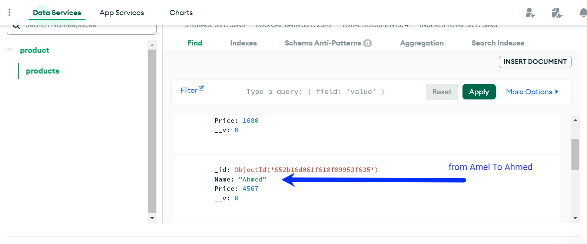

# Build Restfull Api Using Nodejs Express & MongoDB

# To start application
<ul>
    <li>npx nodemon myapp.js </li>
   
    
</ul>

# Project Details 
<ul>
    <li>DataBase Name :  Product</li>
    <li>Collection Name  :  Product</li>
    <li>User Name : aze</li>
    <li>Password Name :  aze</li>
    
</ul>

# screenshot About the Project 

 Get All data in collections 

  

 Update Items for ID => 652b16d061f618f09953f635 from name amel to ahmed 

